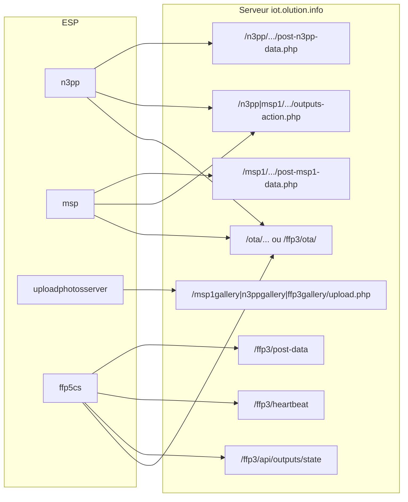

# Audit des échanges serveur distant ↔ ESP

**Date** : 2026-03-08  
**Périmètre** : échanges HTTP entre le serveur unifié (iot.olution.info) et les appareils ESP32 / ESP32-CAM.

Pour le détail des contrats (champs POST, DTO, risques par firmware), voir [audit_firmwares_serveur.md](audit_firmwares_serveur.md).

---

## 1. Tableau récapitulatif des échanges

Tous les échanges sont **initiés par l’ESP** ; le serveur ne pousse jamais vers un appareil.

| Initiateur | Firmware | Méthode | Endpoint (chemin) | Authentification | Rôle |
|------------|----------|---------|-------------------|------------------|------|
| ESP | n3pp | POST | `/n3pp/n3ppdatas/post-n3pp-data.php` | `api_key` (corps) | Envoi données serre |
| ESP | n3pp | GET | `/n3pp/n3ppcontrol/n3pp-outputs-action.php` | — | Lecture état sorties |
| ESP | n3pp | POST | `/n3pp/n3ppcontrol/n3pp-outputs-action.php` | — | Commande sorties |
| ESP | n3pp | GET | `/ota/n3pp/metadata.json` (prod) ou `/ota/n3pp-test/metadata.json` (test) | — | OTA (métadonnées + binaire) |
| ESP | msp | POST | `/msp1/msp1datas/post-msp1-data.php` | `api_key` (corps) | Envoi données météo |
| ESP | msp | GET | `/msp1/msp1control/msp1-outputs-action.php` | — | Lecture état sorties |
| ESP | msp | POST | `/msp1/msp1control/msp1-outputs-action.php` | — | Commande sorties |
| ESP | msp | GET | `/ota/msp/metadata.json` (prod) ou `/ota/msp-test/metadata.json` (test) | — | OTA |
| ESP | uploadphotosserver | POST | `/msp1gallery/upload.php` ou `/n3ppgallery/upload.php` ou `/ffp3/ffp3gallery/upload.php` | Aucune | Upload photo |
| ESP | ffp5cs | POST | `/ffp3/post-data` (ou `-test`, `3`, `3-test` selon profil) | `api_key` (corps) | Envoi données aquaponie |
| ESP | ffp5cs | POST | `/ffp3/heartbeat` (id.) | `api_key` (corps) | Heartbeat / supervision |
| ESP | ffp5cs | GET | `/ffp3/api/outputs/state` (ou variantes) | — | Lecture état sorties GPIO |
| ESP | ffp5cs | GET | `/ffp3/ota/` (metadata.json + firmware.bin, HTTPS) | — | OTA |

Variantes d’environnement pour n3pp / msp : URLs test avec préfixes `n3pp-test/`, `msp1-test/` (même schéma de routes). Pour ffp5cs : profils prod, test, test3, s3 avec endpoints dédiés (post-data-test, heartbeat3, api/outputs3/state, etc.).

---

## 2. Sens des échanges

- **ESP → Serveur** : l’ESP envoie des données (POST capteurs), des heartbeats (ffp5cs), des photos (multipart), et récupère l’état des sorties (GET) ou des mises à jour (GET OTA). Aucun échange n’est initié par le serveur vers l’ESP.
- **Serveur → ESP** : uniquement en **réponse** à une requête (réponse HTTP à un POST, body d’un GET state ou GET OTA). Il n’y a pas de push (WebSocket serveur→ESP, MQTT, etc.) dans l’architecture actuelle.

---

## 3. Schéma des flux

---

## 4. Synthèse authentification et exposition

| Endpoint (type) | Public (sans auth session) | Authentification |
|-----------------|----------------------------|------------------|
| POST `/n3pp/.../post-n3pp-data.php`, `/n3pp-test/...` | Oui | `api_key` dans le corps (comparé à `$_ENV['API_KEY']`) |
| GET/POST `/n3pp/.../n3pp-outputs-action.php` | Oui | Aucune (contrôle par environnement) |
| POST `/msp1/.../post-msp1-data.php`, `/msp1-test/...` | Oui | `api_key` dans le corps |
| GET/POST `/msp1/.../msp1-outputs-action.php` | Oui | Aucune |
| POST `/msp1gallery/upload.php`, `/n3ppgallery/upload.php`, `/ffp3/ffp3gallery/upload.php` | Oui | **Aucune** (upload non authentifié) |
| POST `/ffp3/post-data*`, `/ffp3/heartbeat*` | Oui | `api_key` (HMAC optionnel côté serveur, non utilisé par le firmware) |
| GET `/ffp3/api/outputs*/state` | Oui | Aucune (explicitement exclu du middleware auth) |
| GET `/ota/*`, `/ffp3/ota/*` | Oui | Aucune |

**HTTPS** :  
- **ffp5cs** : requêtes courantes (post-data, heartbeat, outputs/state) en **HTTP** (`BASE_URL`), OTA en **HTTPS** (`BASE_URL_SECURE`). Documenté dans [audit_firmwares_serveur.md](audit_firmwares_serveur.md).  
- **n3pp, msp, uploadphotosserver** : URLs en `http://iot.olution.info/...` ou selon déploiement (HTTPS si le site est servi en HTTPS).

---

## 5. Erreurs, timeouts et retries

| Firmware | Timeout HTTP (typique) | Retries | Comportement en échec |
|----------|------------------------|--------|------------------------|
| **ffp5cs** | 5 s (POST/heartbeat), 8 s (GET outputs/state) ; OTA 15–20 s | 2 tentatives par requête ; queue NVS pour POST en échec (ré-envoi ultérieur) | Offline-first : continue avec config locale, pas de blocage |
| **n3pp, msp** | Dépend de la lib HTTP (n3_common) | Selon implémentation n3_common | Pas de détail dans le dépôt (main.cpp, pas de queue persistante décrite dans l’audit) |
| **uploadphotosserver** | Selon config (photo puis envoi) | — | Deep sleep après envoi (n3pp/ffp3) ; boucle sur msp1 |

Références code : [firmwires/ffp5cs/include/config.h](firmwires/ffp5cs/include/config.h) (`NetworkConfig::HTTP_TIMEOUT_MS`, `MIN_DELAY_BETWEEN_REQUESTS_MS`), [firmwires/ffp5cs/src/web_client.cpp](firmwires/ffp5cs/src/web_client.cpp) (MAX_ATTEMPTS, queue NVS), [firmwires/ffp5cs/include/ota_config.h](firmwires/ffp5cs/include/ota_config.h) (OTA timeout).

---

## 6. Cohérence prod/test — checklist

Pour éviter des données incohérentes, vérifier que **firmware et page contrôle utilisent le même environnement** :

| Profil firmware | POST données | GET outputs/state | Page contrôle | Tables BDD |
|-----------------|--------------|-------------------|---------------|-----------|
| **Prod** (wroom-prod) | `/ffp3/post-data` | `/ffp3/api/outputs/state` | `/aquaponie-control` | ffp3Data, ffp3Outputs |
| **Test** (wroom-test) | `/ffp3/post-data-test` | `/ffp3/api/outputs-test/state` | `/aquaponie-control-test` | ffp3Data2, ffp3Outputs2 |
| **Test3** (wroom-s3-test) | `/ffp3/post-data3-test` | `/ffp3/api/outputs3-test/state` | `/aquamobile-control-test` | ffp3Data3, ffp3Outputs3 |
| **S3 Prod** (wroom-s3-prod) | `/ffp3/post-data3` | `/ffp3/api/outputs3/state` | `/aquamobile-control` | ffp3Data4, ffp3Outputs4 |

**Vérification rapide** : si vous pilotez depuis `/aquaponie-control-test`, l’ESP32 doit utiliser `post-data-test` et `outputs-test/state` ; sinon les commandes web sont invisibles pour l’ESP (ou inversement).

---

## 7. Fichiers de référence

- **Routes serveur** : [serveur/public/index.php](../serveur/public/index.php) (routes et `publicPaths`)
- **Config URLs ffp5cs** : [firmwires/ffp5cs/include/config.h](../firmwires/ffp5cs/include/config.h) (`ServerConfig`), [firmwires/ffp5cs/include/ota_config.h](../firmwires/ffp5cs/include/ota_config.h)
- **Audit détaillé contrats** : [audit_firmwares_serveur.md](audit_firmwares_serveur.md)
- **OTA n3pp, msp, cam** : [audit_ota_firmwares_wifi_partage.md](audit_ota_firmwares_wifi_partage.md)
